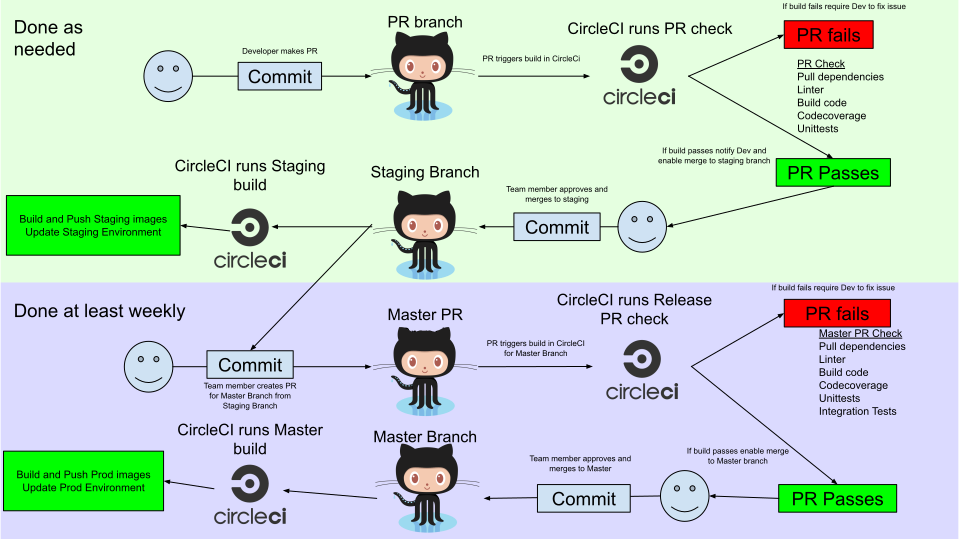

# Our project
https://gettestedcovid.org 

**Our mission: Drive the use of designated testing centers for COVID-19 testing in the US.**

We are doing this through:

1. Building and maintaining the best tool for people to find a COVID-19 testing center, determine eligibility, and plan their trip.
2. Implementing a wide variety of small initiatives to enhance our understanding of testing centers, extend our reach, and provide more complete and up-to-date data.

# Contributing

We have a continually active team of around 40 core volunteers, and a wider group of 200 total volunteers. To see how you can help, reach out to us at info@get-tested-covid19.org

# Technical Specs

## Local Startup

### Server

To get a local server environment up and running use [Docker Compose](https://docs.docker.com/compose/install/). You will need [Docker](https://docs.docker.com/get-docker/) for this.

> docker-compose up

Wait for the build to complete and the db to come up. This may take a long time the first time you run it (e.g. 10 minutes). After the first run, startup will usually be quick.

From here you can get to the API server.

```
curl localhost:5000/ping
pong
```

It is also recommended to use the Postman export in this repository, which contains all of our API calls. You can set your environment url to localhost:5000 and try out the various API calls.

### React app

To start the React app locally, use one of the startup commands in package.json. e.g.

```
# Install Node packages:
yarn install

# Run a dev build locally
yarn start

# Or run a production build locally. This is an optimized build that reflects the production bundle. Sometimes useful for testing.
yarn build

# Or run staging build locally:
yarn build:staging

# With either of the optimized build commands (build or build:staging), after the build completes, you can serve the static files with:
node expressServer.js
```

### docker-compose clarifications

See docker-compose.yml for clarification on what this process is doing. In a nutshell, this launches two containers: a local postgres database, and the API. To see more detail about the API container, see docker/APIDockerfile and  src/server/entrypoint.sh

entrypoint.sh runs several steps: it runs any new sequelize migrations that are detected, it runs any new diff installations that are detected, and it starts up the API.

### Accessing local postgres

To access the postgresQL instance running inside of docker-compose, use psql:

```
# NOTE: The credentials are located in the docker-compose.yml configuration file
# The password is: testing

psql -d postgres -h localhost -p 9999 -U testing
```

## Sequelize / Database maintenance

We use the Sequelize ORM to interact with our PostgresQL database: https://github.com/sequelize/cli . We use the Sequelize 'migrations' feature, which means almost every database change must happen thru a migration file (see db/migrations for clarification).

### Making a change to the database

To make a change to the database, you'll need to make a new migration file. This applies to almost all cases - e.g. a new column, changing a column, adding a foreign key, adding an index, etc. 

```
cd /src/server/db
npx sequelize-cli migration:generate --name YOUR-MIGRATION-NAME
```
This creates a new file in /src/server/db/migrations which contains two functions: up(), and down(). Up is called to apply your changes to the database. Down is applied to roll back your changes. You will need to implement the up and down functions such that rolling forward and backward creates and undoes your changes exactly (with no other side effects). See the existing migrations files for sample code and clarification.

Every time we run 'docker-compose up' or deploy to staging or production environments, 'npx sequelize-cli db:migrate' is run on the target infrastructure and any new migrations files will be detected and run automatically (this is inside entrypoint.sh, which is loaded in the APIDockerfile). This way your database changes will be deployed equally to all environments.

NOTE: Do not change an existing migration file. Your changes will not be detected when deployed, and furthermore, this can break the down() function - meaning we can't automatically roll back the deployed change. It is always possible to fix this mistake thru manually resetting our environment(s), but this is not ideal... 

For local development, you can change a new migration file as much as you like before merging it to the staging or master branches. If you need to undo/redo your local migrations, see the reset steps below:

#### Resetting your local database

Sometimes the database can get corrupted during development if you make database changes (this is avoidable, but it happens sometimes). If the 'docker-compose up' startup script fails due to sequelize migrations not running, or you can't get migrations working, resetting the whole local database is quick and easy. Run these 4 commands, in order:

```
# NOTE: docker-compose must be running locally, then perform these steps:
docker-compose exec api npx sequelize-cli db:seed:undo:all
docker-compose exec api npx sequelize-cli db:migrate:undo:all
docker-compose exec api npx sequelize-cli db:migrate
docker-compose exec api npx sequelize-cli db:seed:all
```

Note that order is very important here. We change table names during the migrations processes, and the seeds are aligned with the most recent table namings. Therefore, the seed undo process should run before the migration undo process, and re-migration should happen before re-seeding.

## CI/CD

We are leveraging Circle CI for CI/CD. PRs will be merged to the 'staging' branch, which deploys to [https://staging.get-tested-covid19.org/](https://staging.get-tested-covid19.org/). We will do quick manual QA, then merge to 'master' to deploy to production.



## Infrastructure

We currently have two environments. Staging and Production are deployed with Terraform via Circle CI.  Both environments use [AWS Fargate](https://aws.amazon.com/fargate/) behind an [AWS Application LoadBalancer](https://docs.aws.amazon.com/elasticloadbalancing/latest/application/introduction.html). We also use an AWS Relational Database Service endpoint using Aurora with Postgres compatability.  

### Infra Changes

For making changes to the infrastructure, see /infrastructure/README.md

## Data / Pipeline

We manage the test centers in our database thru a data pipeline. To add new test centers, update test center information, or learn more about this process, see: /src/data_pipeline/README.md